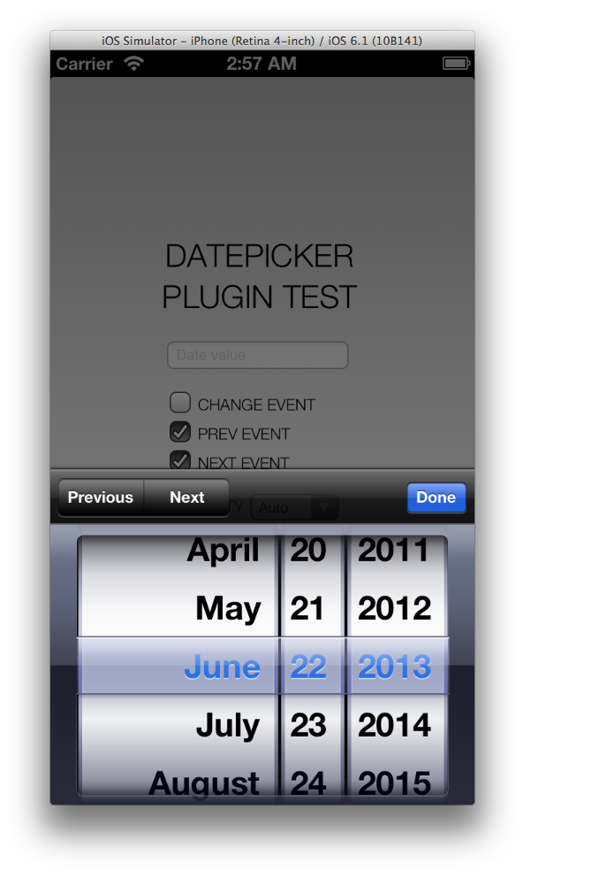

PhoneGap iOS DatePicker Plugin
==============================

Custom Fork of the iOS Datepicker From [Phonegap Plugins](https://github.com/phonegap/phonegap-plugins)

Essential changes are:

1. Javascript part of the datePicker plugin has been defined as an cordova module
2. DatePicker was added support for value change event callback.
3. DatePicker was added hide method.
4. DatePicker was added prev/next buttons and optional callbacks.

### Installation ###

1. Add the `src/DatePicker.h` and `src/DatePicker.m` files to your Plugins folder in your project.
2. Add the `src/DatePicker.js` files to your `www` folder on disk, and add reference to the `DatePicker.js` files as &lt;script&gt; tags in your html file(s)
3. Add an entry for the plugin in the **config.xml** 
    
    Pre 2.8.0
    
    	<plugins>
    		<plugin name="DatePicker" value="DatePicker" />
    	</plugins>
	
	
	Post 2.8.0 and up
	
		<feature name="DatePicker">
        	<param name="ios-package" value="DatePicker"/>
    	</feature>
    

### Usage ###

		var datePicker = cordova.require("cordova/plugin/datepicker");
		var options =  {
			date: new Date(),
			mode: 'date',
			allowOldValues:    true,
			allowFutureValues: true,
			visibility: "auto",
			onChange: function (date) {
				// on datepicker value change
			},
			onDismiss: function (date) {
				// on datepicker dismiss
			},
			onPrev: function () {
				// on datepicker action sheet previous button clicked
			},
			onNext: function () {
				// on datepicker action sheet next button clicked
			}
		};
		datePicker.show(options);  

The options are:

1. `date:` The default _date_ to display if none provided it will automatically use _now_.
2. `mode:` The granularity mode either _date_ or _datetime_, datetime has extended granularity for hours, time and seconds, default _dat'_, if empty the granularity will be _date + time_.
3. `allowOldValues:` Wether to allow older values than the date provided, default true.
4. `allowFutureValues:` Wether to allow future values than the date provided, default true.
5. `visibility:` Howto to display prev/next buttons, auto | visible | hidden
	1. If visibility state set to `auto`, only display _prev / next_ buttons if one of the _`onPrev` / `onNext`_ functions set, otherwise display none 
	2. If visibility state set to `visible` set, both _prev / next_ buttons will be display always, still the enabled state of the buttons will only be display if a correspondent _`onPrev` / `onNext`_ state function has been provided.
	3. If visibility state set to `hidden`, both _prev / next_ buttons will not be visible regardless wether the _`onPrev` / `onNext`_ functions have beeen provided or not.
	
6. `onChange:` optional callback for when the datepicker changes its value, the selected date value will be provided back as an native js date value.
7. `onDismiss:` required callback for when the datepicker has been dismissed, the selected date value will be provided back as an native js date value.
8. `onPrev:` optional callback to enable the ui controled segmented _prev_ button, and to be called when it has been clicked.
9. `onNext:` optional callback to enable the ui controled segmented _next_ button, and to be called when it has been clicked

All options besides the required onDismiss callback are optional.

### Example Project ###

Run the Example project to see a live example, plus simple usage of the DatePicker plugin.

### Screenshot ###

